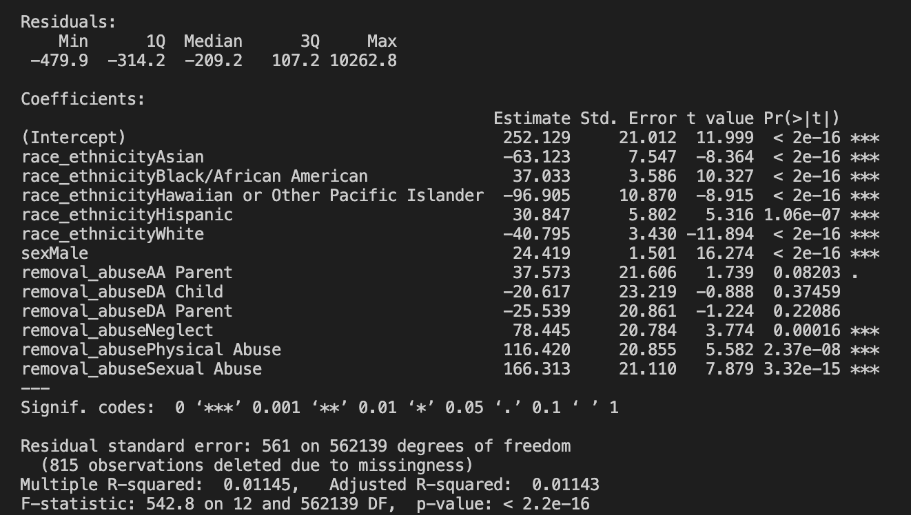
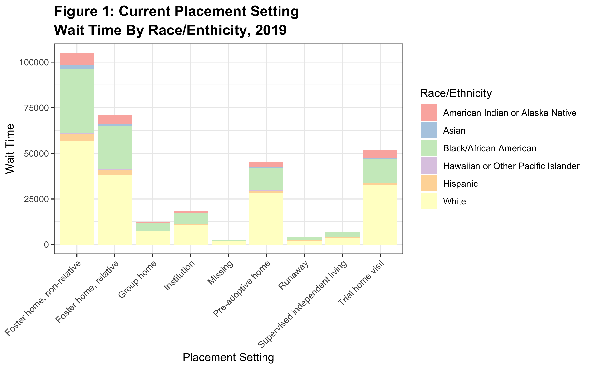
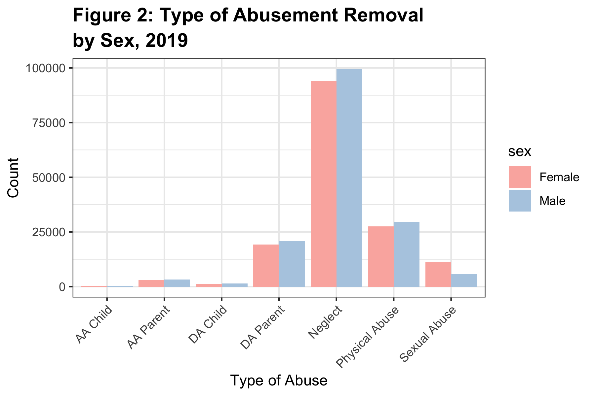
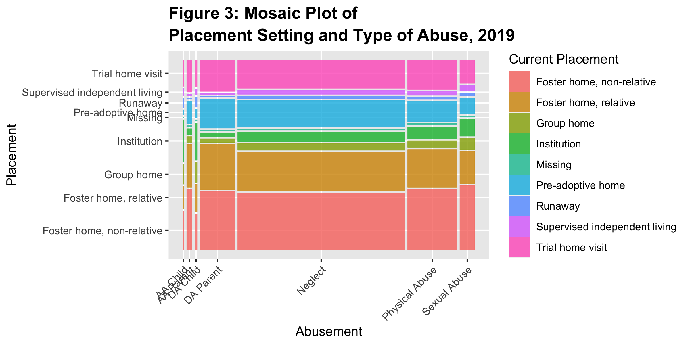

# Personal data projects

- __Project Purpose:__ I used data from the National Data Archive on Child Abuse and Neglect (NDACAN) 2019, which includes all children in foster care in 2019. The NDACAN data have been provided by the National Data Archive on Child Abuse and Neglect, which is housed at Cornell University and overseen by Children Bureau. The data have been de-identified prior to being made available to researchers in the publicly available version of the data, which are the data we used for all analyses. The NDACAN data contains case-level information on all children in foster care for whom State and Tribal title IV-E agencies have responsibility for placement, care or supervision, and on children who are adopted under the auspices of the State and Tribal title IV-E agency'. Title IV-E agencies are required to submit NDACAN data semi-annually to the Children Bureau. 

- __The Goal__: of using this data is to find if there are association between the a few of the selected categories variables in anaylzing, performing, and creating visualization to explain differences, similaries, and discovering new informatiom for NDACAN.

- __Tools used:__ I am using R in VS Code to create my grpahs and visualizations. 
Sources I used to help to finished the project
https://www.statology.org/conditional-mutating-r/

    https://www.datanovia.com/en/blog/ggplot-legend-title-position-and-labels/

    https://ncss-wpengine.netdna-ssl.com/wp-content/themes/ncss/pdf/Procedures/NCSS/Mosaic_Plots.pdf




- __Results:__  the results show, there is a lot of similarities between the type of abuse and current placement setting and sex.  Most children tend to wait longer in a foster family home of non-relative and relative and pre-adoptive homes. Females are more likely to be sexually abused than males and neglect have the highest in both sexes. Showing new findings for the NDACAN that mostly white and Black/African American makes most of the parameter of children and the least to be Asian and American Indian or Alaskan Native in the foster care system. This has significance to be able to seek where the children who were suffered from a type of abuse and where they were placed can demonstrate differences and similarities of the foster care system. Showing others to take further evaluations of the new variables and code to extend and extract more information. If there is an association between other variables and new variables I created to show a better representation of race/ethnicity and type of abuse. To build a statistical finding such as a regression to see if it is significant with an alpha of 0.05. Which there is significant in the following variables of all race_enthincity, sex, and Neglect, Physical Abuse, and Sexual Abuse witha p-value less than the alpha with a weak positive r-squares. Due to multicollinearity, there isn't enough information to concluded this. To further in creating new variables or removing variables to show a better representation of a correlation.
    
    

- In Figure 1, I build a stacked bar chart of the current placement setting with the race and ethnicity of the children from 2019, by creating a waiting time variable to determine the wait time per day. As we can see, majority of white and black/African children have the highest count for each placement setting, which means they are more children in those races in the foster care setting. Missing and Runaway children are more likely to be Black/African American and White, including a few Hispanics and American Indian or Alaskan Native. Group homes could or maybe for disabled or mental disorder children who need 24-hour care, which can be seen to be the case. Trail home visits, foster home non-relative, and relative are more likely to have a longer wait time. 
     
- The variable current placement setting is cateegorize by: 

    __Foster family home, non-relative__: A licensed foster family home regarded by the State as a foster care living arrangement.

    __Foster family home, relative__: A licensed or unlicensed home of the child's relatives regarded by the State as a foster care living arrangement for the child, even if there is no payment.
     Foster family home, non-relative: A licensed foster family home regarded by the State as a foster care living arrangement. 
     
    __Group home__: A licensed or approved home providing 24-hour care for children in a small group setting that generally has from seven to twelve children.
     
    __Institution__: A child care facility operated by a public or private agency and providing 24-hour care and/or treatment for children who require separation from their own homes and group living experience. These facilities may include: child care institutions; residential treatment facilities; maternity homes; etc. An institution is larger than a group home, caring for more than 12 children.

    __Missing__: A child who went missing from the foster care setting.
     
    __Pre-adoptive home__: A home in which the family intends to adopt the child. The family may or may not be receiving a foster care payment or an adoption subsidy on behalf of the child. 

    __Runaway__: The child has run away from the foster care setting. 

    __Supervised independent living__: An alternative traditional living arrangement where the child is under the supervision of the agency but without 24-hour adult supervision, is receiving financial support from the child welfare agency, and is in a setting which provides the opportunity for increased responsibility for self-care. 

    __Trial home visit__: The child has been in a foster care placement but, under State agency supervision, has been returned to the principal caretaker for a limited and specified period of time.




-  As in Figure 2, it's a side-by-side bar chart of the types of abuse removal by sex. As we can see, males are most likely to have a type of abuse from AA CHild to Physical Abuse but in Sexual Abuse females have a higher count, meaning females are doubled to be sexually abused than males. About 90,000 females and 98,000 males were likely to experience and removed by negligent treatment or maltreatment, including domestic violence and mental and emotional abuse. DA Parents' removal is higher than Alcohol Abuse, showing that AA Parent triples in removal than AA Parent. Physical Abuse is the second leading cause of removal from both sexes. 

- Each variables of Abusement is explain as a condition associated with a child's removal from home and contact with the foster care system -  
    __AAChild__: Alcohol Abuse, he child's compulsive use of or need for alcohol. This element should include infants addicted at birth. include children exposed in utero to alcohol.

    __AA Parent__: Alcohol Abuse, the principal caretaker's compulsive use of alcohol that is not of a temporary nature.

    __DA Child__: Drug Abuse, the child's use of drugs that is not of a temporary nature. Includes infants exposed to drugs during pregnancy. Not limited to narcotics

    __DA Parent__: Drug Abuse, the principal caretaker's compulsive use of drugs that is not of a temporary nature.

    __Neglect__: lleged or substantiated negligent treatment or maltreatment, including failure to provide adequate food, clothing, shelter or care. Such as domestic violence and mental emotional abuse is mapped in the varaiable

    __Physical Abuse__: alleged or substantiated physical abuse, injury or maltreatment of the child by a person responsible for the child's welfare.

    __Sexual Abuse__: alleged or substantiated sexual abuse or exploitation of a child by a person who is responsible for the child's welfare.



- As shown in Figure 3, I created a mosaic plot which is made for categorical variables of Removal of Abuse and Placement Setting. As we can see it is obvious Neglect and Physical Abuse are the largest proportional width in the current placements and the smallest to be AA Child and DA Child. Foster home relative and non-relative are more likely to be a current placement for the type of abuse the children are removed for. The least likely is institutional and supervised independent living children who experience a type of abuse to be sent off to in the foster care setting.


## Folder structure

```
- readme.md
- scripts
---- readme.md (short description of each script)
---- data_munge.R
---- data_munge.py
---- eda.R
---- model.py
- data (less than 100 Mb)
---- readme.md (links to data larger than 100 Mb and data details.)
---- crimes.csv
---- visits.json
- documents
---- readme.md (notes while doing your project)
---- mlmethod.pdf
---- api_guide.pdf
```

## Writing about data science

[Thusan's article on how writing about data science is not easy](https://towardsdatascience.com/lets-admit-it-writing-about-data-science-is-not-easy-37a376777d36) could be helpful as you document your project and skills.

## Data sources

You don't need to make these projects complicated. These projects are built to show your work using the skills you have developed during the course. I would make sure that these are presentable in your Github space. You want to demonstrate your creativity. You could use the following links to find a new data set. 

- [FiveThirtyEight](https://github.com/fivethirtyeight/data)
- [TidyTuesday](https://github.com/rfordatascience/tidytuesday)
- [WorkoutWednesday](http://www.workout-wednesday.com/)
- [Kaggle](https://www.kaggle.com/datasets)
- [data.world](https://data.world/search?context=community&entryTypeLabel=dataset&q=free+data&type=all)

## Github pages

It would help if you took the time to publish your repo for easier viewing of the files.  Please follow the directions at [Github pages](https://pages.github.com/) to build your pages footprint on the internet.

## Questions

### Is the expectation of our personal projects similar to that of the class projects we are completing?

Yes & No. Here are a few points to highlight the comparison

1. Three different data sets is the main criteria. Hopefully different challenges to your skills and the data can be in the same area for all three if you desire.
2. You can choose the language. Please choose based on where you want employment.
3. We don't get much into the story telling with our class projects.  But, I would hope you tell a story that includes some graphs and analysis.
4. Think of these as sales pitches for future employment. Your personal projects should be in your own Github space.
